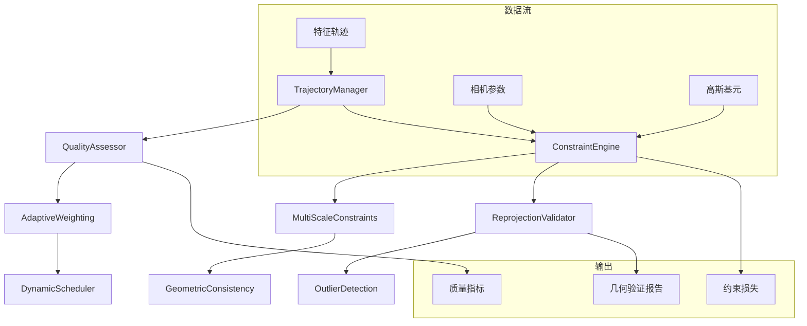

# 高级几何约束和轨迹跟踪模块 - 设计文档

## 概述

本设计文档详细描述了高级几何约束和轨迹跟踪模块的架构设计，该模块将显著提升 GeoTrack-GS 的几何精度和重建质量。设计采用模块化架构，支持多种约束策略的灵活组合和动态调整。

## 架构设计

### 核心组件架构



## 组件设计

### 1. TrajectoryManager（轨迹管理器）

**职责**：管理特征轨迹的生命周期，包括加载、预处理、质量评估和动态更新。

**核心接口**：
```python
class TrajectoryManager:
    def load_trajectories(self, track_file: str) -> List[Trajectory]
    def preprocess_trajectories(self, trajectories: List[Trajectory]) -> List[Trajectory]
    def update_trajectory_quality(self, trajectory: Trajectory, quality_score: float)
    def get_active_trajectories(self, min_quality: float = 0.4) -> List[Trajectory]
    def split_trajectory(self, trajectory: Trajectory, split_points: List[int]) -> List[Trajectory]
```

**关键算法**：
- 轨迹连续性检测：基于光流一致性和特征描述符相似度
- 轨迹分割算法：使用 RANSAC 检测轨迹中的异常点并进行分割
- 动态轨迹关联：基于时空邻近性重新关联断裂的轨迹

### 2. QualityAssessor（质量评估器）

**职责**：评估轨迹和约束的质量，为自适应权重调整提供依据。

**质量评估指标**：
```python
class QualityMetrics:
    trajectory_length: float      # 轨迹长度权重
    visibility_ratio: float       # 可见性比例
    reprojection_error: float     # 重投影误差
    temporal_consistency: float   # 时序一致性
    feature_strength: float       # 特征强度
    geometric_stability: float    # 几何稳定性
```

**评估算法**：
- **轨迹长度评估**：`score = min(length / 10.0, 1.0)`
- **可见性评估**：`score = visible_frames / total_frames`
- **一致性评估**：基于相邻帧间的特征匹配置信度
- **综合质量分数**：加权平均，权重可配置

### 3. ConstraintEngine（约束引擎）

**职责**：核心约束计算引擎，实现多种几何约束的计算和组合。

**约束类型**：
```python
class ConstraintTypes:
    REPROJECTION = "reprojection"           # 重投影约束
    MULTI_SCALE = "multi_scale"             # 多尺度约束
    TEMPORAL_CONSISTENCY = "temporal"        # 时序一致性约束
    EPIPOLAR = "epipolar"                   # 极线约束
    BUNDLE_ADJUSTMENT = "bundle"            # 光束法平差约束
```

**约束计算流程**：
1. **预处理阶段**：筛选有效轨迹，计算基础几何关系
2. **多尺度计算**：在不同分辨率下计算约束
3. **权重融合**：根据质量评估结果动态调整权重
4. **异常值检测**：识别和处理异常约束
5. **最终损失计算**：组合所有约束得到最终损失

### 4. AdaptiveWeighting（自适应权重）

**职责**：根据场景特性和训练状态动态调整约束权重。

**权重调整策略**：
```python
class WeightingStrategy:
    def compute_texture_weight(self, image_region: torch.Tensor) -> float:
        """基于纹理复杂度计算权重"""
        gradient_magnitude = compute_gradient_magnitude(image_region)
        return torch.clamp(gradient_magnitude / 100.0, 0.3, 2.0)
    
    def compute_confidence_weight(self, reprojection_error: float) -> float:
        """基于重投影误差计算置信度权重"""
        return torch.exp(-reprojection_error / 2.0)
    
    def compute_temporal_weight(self, iteration: int) -> float:
        """基于训练进度计算时序权重"""
        if iteration < 1000:
            return 0.01 + 0.04 * (iteration / 1000.0)
        elif iteration < 5000:
            return 0.05 + 0.15 * ((iteration - 1000) / 4000.0)
        else:
            return 0.2
```

### 5. MultiScaleConstraints（多尺度约束）

**职责**：在多个分辨率尺度上计算和验证几何约束。

**多尺度处理流程**：
```python
class MultiScaleProcessor:
    def __init__(self, scales: List[float] = [1.0, 0.5, 0.25]):
        self.scales = scales
        self.scale_weights = [0.5, 0.3, 0.2]  # 对应权重
    
    def compute_multiscale_constraints(self, 
                                     trajectories: List[Trajectory],
                                     cameras: List[Camera]) -> torch.Tensor:
        total_loss = 0.0
        for scale, weight in zip(self.scales, self.scale_weights):
            # 缩放图像和轨迹坐标
            scaled_trajectories = self.scale_trajectories(trajectories, scale)
            scaled_cameras = self.scale_cameras(cameras, scale)
            
            # 计算该尺度下的约束损失
            scale_loss = self.compute_reprojection_loss(scaled_trajectories, scaled_cameras)
            total_loss += weight * scale_loss
            
        return total_loss
```

## 数据模型

### Trajectory 数据结构
```python
@dataclass
class Trajectory:
    id: int
    points_2d: List[Point2D]        # 2D 特征点序列
    camera_indices: List[int]       # 对应的相机索引
    quality_score: float            # 质量分数
    confidence_scores: List[float]  # 每个点的置信度
    is_active: bool                 # 是否参与约束计算
    last_updated: int               # 最后更新的迭代次数
    
@dataclass
class Point2D:
    x: float
    y: float
    frame_id: int
    feature_descriptor: Optional[torch.Tensor]
    detection_confidence: float
```

### ConstraintResult 数据结构
```python
@dataclass
class ConstraintResult:
    loss_value: torch.Tensor
    individual_errors: List[float]
    outlier_mask: torch.Tensor
    quality_metrics: Dict[str, float]
    scale_contributions: Dict[float, float]
    weight_distribution: Dict[str, float]
```

## 错误处理策略

### 1. 轨迹质量异常处理
- **检测**：质量分数低于阈值或包含过多异常值
- **处理**：自动排除低质量轨迹，记录排除原因
- **恢复**：定期重新评估被排除的轨迹

### 2. 约束计算异常处理
- **数值不稳定**：使用鲁棒损失函数和梯度裁剪
- **内存不足**：动态调整批处理大小
- **CUDA 错误**：自动回退到 CPU 计算

### 3. 收敛问题处理
- **检测**：监控损失函数的收敛趋势
- **干预**：自动调整学习率和约束权重
- **重启**：必要时重新初始化部分参数

## 测试策略

### 单元测试
- 轨迹质量评估算法测试
- 多尺度约束计算测试
- 权重调整策略测试

### 集成测试
- 完整约束计算流程测试
- 与现有 GaussianModel 的集成测试
- 性能基准测试

### 验证测试
- 使用标准数据集验证几何精度提升
- 对比原始实现的性能差异
- 不同场景类型的适应性测试