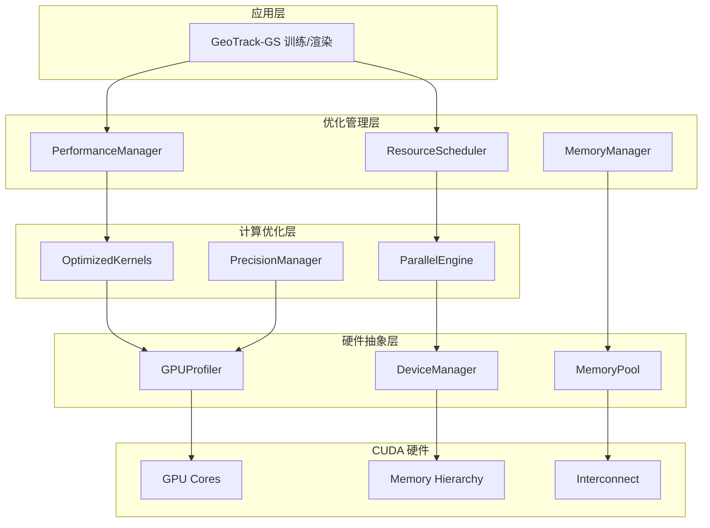

# CUDA 加速优化模块 - 设计文档

## 概述

本设计文档详细描述了 CUDA 加速优化模块的架构设计，该模块将通过深度优化 GPU 计算流程和内存管理，实现 GeoTrack-GS 的显著性能提升。设计采用分层优化架构，从底层 CUDA kernel 到上层资源管理的全方位优化。

## 架构设计

### 整体架构图



## 核心组件设计

### 1. PerformanceManager（性能管理器）

**职责**：统一管理系统性能监控、分析和自动调优。

**核心接口**：
```cpp
class PerformanceManager {
public:
    struct PerformanceMetrics {
        float gpu_utilization;
        float memory_utilization;
        float compute_throughput;
        float memory_bandwidth;
        float temperature;
        std::vector<float> kernel_times;
    };
    
    void initialize(const GPUConfig& config);
    PerformanceMetrics monitor_performance();
    void auto_tune_parameters();
    void generate_performance_report();
    void set_performance_target(float target_utilization);
    
private:
    std::unique_ptr<GPUProfiler> profiler_;
    std::unique_ptr<AutoTuner> tuner_;
    PerformanceHistory history_;
};
```

**关键算法**：
- **自适应调优算法**：基于历史性能数据和当前负载动态调整参数
- **瓶颈识别算法**：通过性能计数器分析识别计算和内存瓶颈
- **负载预测算法**：基于场景特征预测计算负载和资源需求

### 2. OptimizedKernels（优化内核集合）

**职责**：提供高度优化的 CUDA kernel 实现，替换原有的计算核心。

**关键优化策略**：

#### 高斯基元渲染优化
```cuda
// 优化的高斯基元渲染 kernel
__global__ void optimized_gaussian_render_kernel(
    const GaussianData* __restrict__ gaussians,
    const CameraParams* __restrict__ cameras,
    float* __restrict__ output_image,
    const int num_gaussians,
    const int image_width,
    const int image_height
) {
    // 使用共享内存缓存频繁访问的数据
    __shared__ float shared_camera_params[CAMERA_PARAMS_SIZE];
    __shared__ GaussianData shared_gaussians[BLOCK_SIZE];
    
    // Warp-level 协作加载
    const int warp_id = threadIdx.x / 32;
    const int lane_id = threadIdx.x % 32;
    
    // 合并内存访问模式
    if (threadIdx.x < CAMERA_PARAMS_SIZE) {
        shared_camera_params[threadIdx.x] = ((float*)cameras)[threadIdx.x];
    }
    
    // 向量化内存访问
    float4 gaussian_data = reinterpret_cast<const float4*>(gaussians)[blockIdx.x * blockDim.x + threadIdx.x];
    
    // 使用 tensor cores 进行矩阵运算（如果可用）
    #if __CUDA_ARCH__ >= 700
        // Tensor Core 优化的矩阵乘法
        wmma::fragment<wmma::matrix_a, 16, 16, 16, half, wmma::row_major> a_frag;
        wmma::fragment<wmma::matrix_b, 16, 16, 16, half, wmma::col_major> b_frag;
        wmma::fragment<wmma::accumulator, 16, 16, 16, float> c_frag;
    #endif
    
    __syncthreads();
    
    // 优化的渲染计算逻辑
    // ...
}
```

#### 重投影约束优化
```cuda
// 批量重投影约束计算
__global__ void batch_reprojection_constraint_kernel(
    const float3* __restrict__ points_3d,
    const float2* __restrict__ points_2d,
    const CameraMatrix* __restrict__ cameras,
    float* __restrict__ errors,
    float* __restrict__ weights,
    const int num_constraints,
    const int batch_size
) {
    // 使用纹理内存优化相机参数访问
    const int constraint_id = blockIdx.x * blockDim.x + threadIdx.x;
    
    if (constraint_id >= num_constraints) return;
    
    // 向量化加载 3D 点
    float3 point_3d = points_3d[constraint_id];
    float2 point_2d = points_2d[constraint_id];
    
    // 使用 fast math 函数优化
    float projected_x, projected_y;
    fast_project_point(point_3d, cameras[constraint_id / batch_size], 
                      &projected_x, &projected_y);
    
    // 计算重投影误差
    float error_x = projected_x - point_2d.x;
    float error_y = projected_y - point_2d.y;
    float error = __fsqrt_rn(error_x * error_x + error_y * error_y);
    
    // 计算自适应权重
    float weight = __expf(-error * error / (2.0f * SIGMA_SQUARED));
    
    errors[constraint_id] = error;
    weights[constraint_id] = weight;
}
```

### 3. MemoryManager（内存管理器）

**职责**：优化 GPU 内存分配、访问模式和数据传输。

**内存优化策略**：
```cpp
class MemoryManager {
public:
    struct MemoryPool {
        void* base_ptr;
        size_t total_size;
        size_t used_size;
        std::vector<MemoryBlock> free_blocks;
        std::vector<MemoryBlock> used_blocks;
    };
    
    class CoalescedAccessPattern {
    public:
        // 确保内存访问的合并性
        void* allocate_aligned(size_t size, size_t alignment = 128);
        void optimize_data_layout(void* data, size_t count, size_t element_size);
        void prefetch_data(void* data, size_t size, cudaStream_t stream);
    };
    
    // 内存池管理
    void* allocate_from_pool(size_t size, MemoryType type);
    void deallocate_to_pool(void* ptr, MemoryType type);
    void defragment_memory();
    
    // 异步内存传输
    void async_copy_h2d(void* dst, const void* src, size_t size, cudaStream_t stream);
    void async_copy_d2h(void* dst, const void* src, size_t size, cudaStream_t stream);
    
private:
    std::unordered_map<MemoryType, MemoryPool> memory_pools_;
    CoalescedAccessPattern access_optimizer_;
};
```

### 4. ParallelEngine（并行计算引擎）

**职责**：优化并行计算策略和负载均衡。

**并行优化技术**：
```cpp
class ParallelEngine {
public:
    struct ComputeConfig {
        dim3 grid_size;
        dim3 block_size;
        size_t shared_memory_size;
        int num_streams;
        bool use_cooperative_groups;
    };
    
    // 动态配置优化
    ComputeConfig optimize_launch_config(
        const KernelInfo& kernel_info,
        const DataInfo& data_info,
        const GPUProperties& gpu_props
    );
    
    // 多流并行执行
    void execute_parallel_kernels(
        const std::vector<KernelLaunch>& kernels,
        const std::vector<cudaStream_t>& streams
    );
    
    // 负载均衡
    void balance_workload(
        const WorkloadInfo& workload,
        std::vector<WorkUnit>& work_units
    );
    
private:
    std::vector<cudaStream_t> compute_streams_;
    std::vector<cudaStream_t> memory_streams_;
    LoadBalancer load_balancer_;
};
```

### 5. PrecisionManager（精度管理器）

**职责**：在性能优化和数值精度之间找到最优平衡。

**混合精度策略**：
```cpp
class PrecisionManager {
public:
    enum class PrecisionLevel {
        HALF,      // FP16
        SINGLE,    // FP32
        DOUBLE     // FP64
    };
    
    struct PrecisionConfig {
        PrecisionLevel default_precision;
        std::unordered_map<std::string, PrecisionLevel> kernel_precisions;
        float error_threshold;
        bool auto_fallback;
    };
    
    // 自适应精度选择
    PrecisionLevel select_precision(
        const std::string& operation_name,
        const NumericalRequirements& requirements
    );
    
    // 数值稳定性检查
    bool validate_numerical_stability(
        const float* reference_data,
        const float* optimized_data,
        size_t count,
        float tolerance
    );
    
    // 精度回退机制
    void fallback_to_higher_precision(const std::string& operation_name);
    
private:
    PrecisionConfig config_;
    NumericalValidator validator_;
};
```

## 数据结构优化

### 内存布局优化
```cpp
// 结构体数组 (SoA) 布局优化
struct OptimizedGaussianData {
    // 分离存储以优化内存访问
    float* positions_x;      // [N] 连续存储
    float* positions_y;      // [N] 连续存储  
    float* positions_z;      // [N] 连续存储
    float* scales_x;         // [N] 连续存储
    float* scales_y;         // [N] 连续存储
    float* scales_z;         // [N] 连续存储
    float* rotations;        // [N*4] 四元数
    float* opacities;        // [N] 透明度
    float* sh_coefficients;  // [N*SH_COUNT] 球谐系数
    
    // 对齐到 128 字节边界以优化缓存性能
    void align_memory_layout();
    
    // 预取数据到缓存
    void prefetch_data(int start_idx, int count);
};

// 缓存友好的相机数据布局
struct __align__(16) OptimizedCameraData {
    float4 rotation_quaternion;    // 16 字节对齐
    float4 translation;           // 16 字节对齐
    float4 intrinsics;           // fx, fy, cx, cy
    float4 distortion;           // k1, k2, p1, p2
};
```

## 性能监控系统

### GPU 性能计数器集成
```cpp
class GPUProfiler {
public:
    struct KernelProfile {
        std::string kernel_name;
        float execution_time_ms;
        float occupancy_percentage;
        size_t shared_memory_usage;
        size_t register_usage;
        float memory_throughput_gb_s;
        float compute_utilization;
    };
    
    void start_profiling(const std::string& session_name);
    void end_profiling();
    KernelProfile profile_kernel(const std::string& kernel_name);
    void generate_performance_report();
    
private:
    cupti_profiler profiler_;
    std::vector<KernelProfile> kernel_profiles_;
};
```

## 多 GPU 支持架构

### 数据并行策略
```cpp
class MultiGPUManager {
public:
    struct GPUNode {
        int device_id;
        cudaDeviceProp properties;
        float compute_capability;
        size_t available_memory;
        std::vector<cudaStream_t> streams;
    };
    
    void initialize_multi_gpu(const std::vector<int>& device_ids);
    void distribute_workload(const TrainingBatch& batch);
    void synchronize_gradients();
    void aggregate_results();
    
private:
    std::vector<GPUNode> gpu_nodes_;
    ncclComm_t nccl_communicator_;
    DataDistributor distributor_;
};
```

## 错误处理和回退机制

### 自动性能回退
```cpp
class PerformanceGuard {
public:
    enum class FallbackLevel {
        NONE,
        REDUCE_PRECISION,
        REDUCE_BATCH_SIZE,
        DISABLE_OPTIMIZATION,
        CPU_FALLBACK
    };
    
    void monitor_performance();
    void handle_performance_degradation();
    void handle_memory_pressure();
    void handle_thermal_throttling();
    
private:
    PerformanceThresholds thresholds_;
    FallbackStrategy fallback_strategy_;
};
```

## 测试和验证策略

### 性能基准测试
- **微基准测试**：单个 kernel 的性能测试
- **端到端基准测试**：完整训练流程的性能测试
- **内存带宽测试**：内存访问效率验证
- **数值精度测试**：优化前后的精度对比

### 回归测试
- **功能回归测试**：确保优化不影响功能正确性
- **性能回归测试**：监控性能优化的持续有效性
- **稳定性测试**：长时间运行的稳定性验证