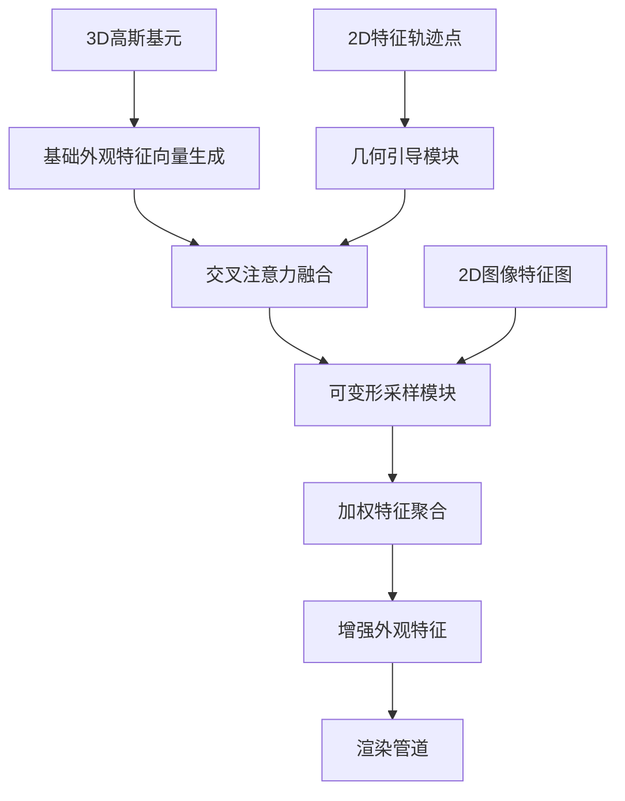

# GT-DCA外观建模模块设计文档

## 概述

GT-DCA（几何引导可变形交叉注意力）模块是一个创新的外观建模增强系统，旨在解决标准3D高斯溅射（3DGS）中球谐函数（SH）在处理复杂非朗伯表面时的局限性。该模块采用两阶段"引导-采样"范式，结合GeoTrack-GS框架提供的高保真几何信息，显著提升对复杂视角依赖效应的建模能力。

核心设计理念：
- **几何引导**：利用精确的几何轨迹点信息指导外观特征学习
- **可变形采样**：通过预测采样偏移量获取更丰富的图像特征
- **即插即用**：作为增强组件无缝集成到现有3DGS管道中

## 架构

### 系统架构图



### 两阶段处理流程

1. **几何引导阶段**
   - 输入：3D高斯基元的基础外观特征向量（查询）+ 2D特征轨迹点（几何上下文）
   - 处理：通过交叉注意力机制将几何信息注入查询向量
   - 输出：几何引导的查询向量

2. **可变形采样阶段**
   - 输入：几何引导的查询向量 + 当前视角的2D图像特征图
   - 处理：预测采样偏移量和权重，执行加权特征采样
   - 输出：最终的增强外观特征

## 组件和接口

### 核心组件

#### 1. 基础外观特征生成器 (BaseAppearanceFeatureGenerator)
```python
class BaseAppearanceFeatureGenerator:
    def __init__(self, feature_dim: int = 256):
        self.feature_dim = feature_dim
        
    def generate_query_features(self, gaussian_primitives: Tensor) -> Tensor:
        """为每个3D高斯基元生成可学习的基础外观特征向量"""
        pass
```

#### 2. 几何引导模块 (GeometryGuidedModule)
```python
class GeometryGuidedModule:
    def __init__(self, feature_dim: int, hidden_dim: int = 128):
        self.projection_mlp = MLP(2, hidden_dim, feature_dim)
        self.cross_attention = CrossAttention(feature_dim)
        
    def forward(self, query_features: Tensor, track_points_2d: Tensor) -> Tensor:
        """通过交叉注意力将几何上下文注入查询向量"""
        pass
```

#### 3. 可变形采样模块 (DeformableSamplingModule)
```python
class DeformableSamplingModule:
    def __init__(self, feature_dim: int, num_sample_points: int = 8):
        self.offset_predictor = MLP(feature_dim, hidden_dim, num_sample_points * 2)
        self.weight_predictor = MLP(feature_dim, hidden_dim, num_sample_points)
        
    def forward(self, guided_queries: Tensor, feature_map_2d: Tensor, 
                projection_coords: Tensor) -> Tensor:
        """执行可变形采样和加权聚合"""
        pass
```

#### 4. GT-DCA主模块 (GTDCAModule)
```python
class GTDCAModule(nn.Module):
    def __init__(self, feature_dim: int = 256, num_sample_points: int = 8):
        self.base_generator = BaseAppearanceFeatureGenerator(feature_dim)
        self.geometry_guided = GeometryGuidedModule(feature_dim)
        self.deformable_sampling = DeformableSamplingModule(feature_dim, num_sample_points)
        
    def forward(self, gaussian_primitives: Tensor, track_points_2d: Tensor, 
                feature_map_2d: Tensor, projection_coords: Tensor) -> Tensor:
        """完整的GT-DCA前向传播流程"""
        pass
```

### 接口设计

#### 输入接口
- `gaussian_primitives`: 3D高斯基元参数 (N, primitive_dim)
- `track_points_2d`: 2D特征轨迹点坐标 (M, 2)
- `feature_map_2d`: 当前视角的2D图像特征图 (H, W, C)
- `projection_coords`: 高斯点的2D投影坐标 (N, 2)

#### 输出接口
- `enhanced_appearance_features`: 增强的外观特征 (N, feature_dim)

#### 集成接口
```python
class GaussianModel:
    def __init__(self):
        self.gt_dca = GTDCAModule()
        # 其他现有组件...
        
    def get_appearance_features(self, viewpoint_camera):
        """替代或增强原有SH系数的接口"""
        if self.use_gt_dca:
            return self.gt_dca(...)
        else:
            return self.get_sh_features(...)
```

## 数据模型

### 核心数据结构

#### 1. 轨迹点数据结构
```python
@dataclass
class TrackPoint:
    point_id: int
    coordinates_2d: Tuple[float, float]
    confidence: float
    frame_id: int
    feature_descriptor: Optional[Tensor] = None
```

#### 2. 采样点数据结构
```python
@dataclass
class SamplingPoint:
    base_coord: Tuple[float, float]
    offset: Tuple[float, float]
    weight: float
    sampled_feature: Tensor
```

#### 3. 外观特征数据结构
```python
@dataclass
class AppearanceFeature:
    base_features: Tensor  # 基础外观特征
    geometry_guided_features: Tensor  # 几何引导后的特征
    enhanced_features: Tensor  # 最终增强特征
    sampling_metadata: List[SamplingPoint]  # 采样元数据
```

### 数据流设计

1. **几何数据流**：extract_and_triangulate_tracks.py → 2D轨迹点 → 几何引导模块
2. **图像数据流**：输入图像 → 特征提取器 → 2D特征图 → 可变形采样模块
3. **高斯数据流**：3D高斯基元 → 基础特征生成器 → 查询向量 → 增强特征

## 错误处理

### 错误类型和处理策略

#### 1. 数据完整性错误
```python
class DataIntegrityError(Exception):
    """轨迹点数据不完整或损坏"""
    pass

def handle_incomplete_tracks(track_points: List[TrackPoint]) -> List[TrackPoint]:
    """处理不完整的轨迹点数据"""
    if len(track_points) < MIN_TRACK_POINTS:
        logger.warning("轨迹点数量不足，启用降级模式")
        return generate_fallback_tracks()
    return filter_valid_tracks(track_points)
```

#### 2. 边界处理错误
```python
def safe_sample_feature_map(feature_map: Tensor, coords: Tensor) -> Tensor:
    """安全的特征图采样，处理边界情况"""
    h, w = feature_map.shape[:2]
    
    # 边界裁剪
    coords = torch.clamp(coords, min=0, max=torch.tensor([w-1, h-1]))
    
    # 边界填充策略
    if coords.min() < 0 or coords[:, 0].max() >= w or coords[:, 1].max() >= h:
        feature_map = F.pad(feature_map, (1, 1, 1, 1), mode='replicate')
        coords = coords + 1
    
    return F.grid_sample(feature_map, coords, align_corners=True)
```

#### 3. 降级处理机制
```python
class FallbackHandler:
    def __init__(self, sh_model):
        self.sh_model = sh_model
        
    def handle_geometry_failure(self, gaussian_primitives: Tensor) -> Tensor:
        """几何信息缺失时回退到SH模型"""
        logger.info("几何信息不可用，回退到标准SH模型")
        return self.sh_model.get_sh_features(gaussian_primitives)
```

## 测试策略

### 单元测试

#### 1. 组件级测试
```python
class TestGeometryGuidedModule(unittest.TestCase):
    def test_cross_attention_output_shape(self):
        """测试交叉注意力输出形状"""
        pass
        
    def test_mlp_projection_accuracy(self):
        """测试MLP投射精度"""
        pass
```

#### 2. 集成测试
```python
class TestGTDCAIntegration(unittest.TestCase):
    def test_end_to_end_pipeline(self):
        """测试完整管道流程"""
        pass
        
    def test_3dgs_integration(self):
        """测试与3DGS系统集成"""
        pass
```

### 性能测试

#### 1. 计算效率测试
```python
def benchmark_geometry_guidance():
    """基准测试几何引导模块性能"""
    pass
    
def benchmark_deformable_sampling():
    """基准测试可变形采样性能"""
    pass
```

#### 2. 内存使用测试
```python
def test_memory_usage_scaling():
    """测试内存使用随场景规模的扩展性"""
    pass
```

### 质量测试

#### 1. 渲染质量评估
```python
def evaluate_rendering_quality():
    """评估渲染质量改进"""
    # PSNR, SSIM, LPIPS等指标
    pass
```

#### 2. 视角依赖效果测试
```python
def test_view_dependent_effects():
    """测试视角依赖效果的改进"""
    # 金属高光、掠射角反射等特殊效果
    pass
```

## 设计决策和理由

### 1. 两阶段架构设计
**决策**：采用"几何引导 + 可变形采样"的两阶段架构
**理由**：
- 分离几何一致性和图像细节处理，提高模块化程度
- 几何引导阶段确保宏观一致性，采样阶段捕获微观细节
- 便于独立优化和调试各个阶段

### 2. 交叉注意力机制选择
**决策**：使用交叉注意力而非自注意力进行几何信息融合
**理由**：
- 查询向量（外观特征）和键值向量（几何信息）来源不同
- 交叉注意力能更好地建模几何与外观的关联关系
- 计算复杂度相对较低

### 3. 可变形采样策略
**决策**：预测采样偏移量而非固定采样模式
**理由**：
- 适应不同表面材质和几何特征的采样需求
- 提高对复杂纹理和反射效果的建模能力
- 保持与现有可变形卷积技术的一致性

### 4. 即插即用设计
**决策**：设计为可选的增强模块而非替换现有系统
**理由**：
- 保持与现有3DGS管道的兼容性
- 允许渐进式部署和A/B测试
- 降低集成风险和开发成本

### 5. 降级机制设计
**决策**：实现多层次的降级处理机制
**理由**：
- 提高系统鲁棒性，处理各种异常情况
- 确保在部分功能失效时系统仍能正常运行
- 便于在不同质量的输入数据下保持稳定性能