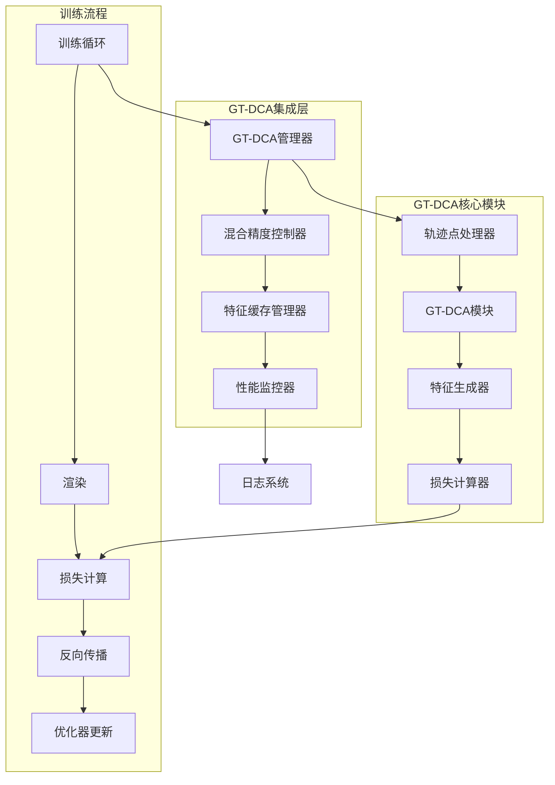

# GT-DCA训练集成修复设计文档

## 概述

本设计文档详细描述了如何修复GT-DCA模块在训练流程中的集成问题，引入混合精度支持，并优化整体性能。设计采用模块化方法，确保向后兼容性和系统稳定性。

## 架构

### 整体架构图



### 核心组件关系

1. **GT-DCA训练集成管理器**：协调GT-DCA与训练流程的集成
2. **混合精度控制器**：管理FP16/FP32精度切换
3. **智能缓存系统**：优化GT-DCA特征的计算和存储
4. **轨迹点数据处理器**：处理和验证轨迹点数据
5. **GT-DCA损失集成器**：将GT-DCA损失集成到主训练循环

## 组件和接口

### 1. GT-DCA训练集成管理器

```python
class GTDCATrainingIntegrationManager:
    """GT-DCA训练集成管理器"""
    
    def __init__(self, config: GTDCAConfig, mixed_precision: bool = True):
        self.config = config
        self.mixed_precision_controller = MixedPrecisionController(enabled=mixed_precision)
        self.cache_manager = GTDCAFeatureCacheManager()
        self.performance_monitor = GTDCAPerformanceMonitor()
        self.loss_integrator = GTDCALossIntegrator()
    
    def integrate_with_training_step(
        self, 
        gaussians: GaussianModel, 
        viewpoint_camera: object,
        iteration: int
    ) -> GTDCATrainingResult:
        """集成GT-DCA到单个训练步骤"""
        pass
    
    def should_use_gt_dca(self, iteration: int) -> bool:
        """智能决策是否在当前迭代使用GT-DCA"""
        pass
    
    def compute_gt_dca_loss(
        self, 
        gt_dca_features: Tensor, 
        standard_features: Tensor,
        rendered_image: Tensor,
        gt_image: Tensor
    ) -> Tensor:
        """计算GT-DCA相关损失"""
        pass
```

### 2. 混合精度控制器

```python
class MixedPrecisionController:
    """混合精度控制器"""
    
    def __init__(self, enabled: bool = True):
        self.enabled = enabled
        self.scaler = torch.cuda.amp.GradScaler() if enabled else None
        self.autocast_context = torch.cuda.amp.autocast if enabled else nullcontext
    
    def forward_with_precision(self, model_fn: callable, *args, **kwargs):
        """使用适当精度执行前向传播"""
        if self.enabled:
            with torch.cuda.amp.autocast():
                return model_fn(*args, **kwargs)
        else:
            return model_fn(*args, **kwargs)
    
    def scale_loss_and_backward(self, loss: Tensor, optimizer: torch.optim.Optimizer):
        """缩放损失并执行反向传播"""
        if self.enabled and self.scaler:
            self.scaler.scale(loss).backward()
            self.scaler.step(optimizer)
            self.scaler.update()
        else:
            loss.backward()
            optimizer.step()
```

### 3. 智能特征缓存管理器

```python
class GTDCAFeatureCacheManager:
    """GT-DCA特征缓存管理器"""
    
    def __init__(self, max_cache_size: int = 1000):
        self.cache = {}
        self.max_cache_size = max_cache_size
        self.access_times = {}
        self.gaussian_versions = {}
    
    def get_cached_features(
        self, 
        gaussian_hash: str, 
        viewpoint_hash: str
    ) -> Optional[Tensor]:
        """获取缓存的GT-DCA特征"""
        pass
    
    def cache_features(
        self, 
        gaussian_hash: str, 
        viewpoint_hash: str, 
        features: Tensor
    ):
        """缓存GT-DCA特征"""
        pass
    
    def invalidate_cache_for_gaussians(self, gaussian_indices: List[int]):
        """为指定的高斯点无效化缓存"""
        pass
    
    def cleanup_cache(self):
        """清理过期缓存"""
        pass
```

### 4. 轨迹点数据处理器

```python
class TrackPointDataProcessor:
    """轨迹点数据处理器"""
    
    def __init__(self, config: GTDCAConfig):
        self.config = config
        self.data_validator = TrackPointDataValidator()
        self.quality_analyzer = TrackPointQualityAnalyzer()
    
    def load_and_validate_track_points(self, track_path: str) -> TrackPointLoadResult:
        """加载并验证轨迹点数据"""
        pass
    
    def filter_low_quality_points(
        self, 
        track_points: List[TrackPoint]
    ) -> Tuple[List[TrackPoint], TrackPointFilterStats]:
        """过滤低质量轨迹点"""
        pass
    
    def analyze_data_quality(self, track_points: List[TrackPoint]) -> TrackPointQualityReport:
        """分析轨迹点数据质量"""
        pass
    
    def generate_improvement_suggestions(
        self, 
        quality_report: TrackPointQualityReport
    ) -> List[str]:
        """生成数据改进建议"""
        pass
```

### 5. GT-DCA损失集成器

```python
class GTDCALossIntegrator:
    """GT-DCA损失集成器"""
    
    def __init__(self):
        self.consistency_loss_fn = GTDCAConsistencyLoss()
        self.feature_quality_estimator = GTDCAFeatureQualityEstimator()
        self.adaptive_weight_scheduler = GTDCAAdaptiveWeightScheduler()
    
    def compute_integrated_loss(
        self,
        gt_dca_features: Tensor,
        standard_features: Tensor,
        rendered_image: Tensor,
        gt_image: Tensor,
        iteration: int
    ) -> GTDCALossResult:
        """计算集成的GT-DCA损失"""
        pass
    
    def compute_consistency_loss(
        self,
        gt_dca_features: Tensor,
        standard_features: Tensor
    ) -> Tensor:
        """计算GT-DCA与标准特征的一致性损失"""
        pass
    
    def estimate_feature_quality(self, gt_dca_features: Tensor) -> float:
        """估计GT-DCA特征质量"""
        pass
    
    def get_adaptive_weight(self, iteration: int, feature_quality: float) -> float:
        """获取自适应损失权重"""
        pass
```

## 数据模型

### GT-DCA训练结果

```python
@dataclass
class GTDCATrainingResult:
    """GT-DCA训练步骤结果"""
    gt_dca_features: Optional[Tensor]           # GT-DCA特征
    gt_dca_loss: Optional[Tensor]               # GT-DCA损失
    consistency_loss: Optional[Tensor]          # 一致性损失
    feature_quality_score: float                # 特征质量分数
    processing_time: float                      # 处理时间
    memory_usage: Dict[str, float]              # 内存使用情况
    cache_hit_rate: float                       # 缓存命中率
    used_mixed_precision: bool                  # 是否使用混合精度
    fallback_reason: Optional[str]              # 回退原因（如果有）
```

### 轨迹点加载结果

```python
@dataclass
class TrackPointLoadResult:
    """轨迹点加载结果"""
    track_points: List[TrackPoint]              # 加载的轨迹点
    total_loaded: int                           # 总加载数量
    valid_points: int                           # 有效点数量
    filtered_points: int                        # 过滤的点数量
    quality_score: float                        # 整体质量分数
    load_time: float                            # 加载时间
    validation_errors: List[str]                # 验证错误
    improvement_suggestions: List[str]          # 改进建议
```

### 性能监控数据

```python
@dataclass
class GTDCAPerformanceMetrics:
    """GT-DCA性能指标"""
    forward_pass_time: float                    # 前向传播时间
    memory_allocated: float                     # 分配的内存
    memory_cached: float                        # 缓存的内存
    cache_hit_rate: float                       # 缓存命中率
    mixed_precision_speedup: float              # 混合精度加速比
    feature_quality_score: float               # 特征质量分数
    gpu_utilization: float                      # GPU利用率
    throughput: float                           # 吞吐量（样本/秒）
```

## 错误处理

### 错误处理策略

1. **轨迹点数据错误**
   - 数据格式不正确：提供格式转换工具
   - 数据质量不足：提供质量改进建议
   - 数据缺失：提供数据生成指导

2. **GT-DCA计算错误**
   - 显存不足：自动降低批处理大小或禁用GT-DCA
   - 数值不稳定：回退到FP32精度
   - 模块初始化失败：使用标准SH模型

3. **混合精度错误**
   - 梯度溢出：自动调整缩放因子
   - 数值精度问题：选择性使用FP32
   - 硬件不支持：自动禁用混合精度

### 错误恢复机制

```python
class GTDCAErrorHandler:
    """GT-DCA错误处理器"""
    
    def handle_track_point_error(self, error: Exception) -> TrackPointErrorRecovery:
        """处理轨迹点相关错误"""
        pass
    
    def handle_computation_error(self, error: Exception) -> ComputationErrorRecovery:
        """处理计算相关错误"""
        pass
    
    def handle_memory_error(self, error: Exception) -> MemoryErrorRecovery:
        """处理内存相关错误"""
        pass
    
    def should_fallback_to_standard(self, error_history: List[Exception]) -> bool:
        """判断是否应该回退到标准模型"""
        pass
```

## 测试策略

### 单元测试

1. **GT-DCA集成管理器测试**
   - 测试训练步骤集成
   - 测试智能调用策略
   - 测试损失计算

2. **混合精度控制器测试**
   - 测试精度切换
   - 测试性能提升
   - 测试数值稳定性

3. **缓存管理器测试**
   - 测试缓存命中率
   - 测试缓存无效化
   - 测试内存管理

### 集成测试

1. **端到端训练测试**
   - 测试完整训练流程
   - 测试GT-DCA对训练效果的影响
   - 测试性能优化效果

2. **错误处理测试**
   - 测试各种错误场景
   - 测试错误恢复机制
   - 测试回退策略

3. **性能基准测试**
   - 测试混合精度加速效果
   - 测试缓存优化效果
   - 测试内存使用优化

### 性能测试

1. **基准性能测试**
   - 对比启用/禁用GT-DCA的性能
   - 对比启用/禁用混合精度的性能
   - 测试不同缓存策略的效果

2. **压力测试**
   - 测试大规模场景下的性能
   - 测试长时间训练的稳定性
   - 测试内存限制下的表现

## 部署考虑

### 向后兼容性

- 保持现有API接口不变
- 新功能通过配置参数控制
- 提供平滑的迁移路径

### 配置管理

- 通过命令行参数控制GT-DCA功能
- 提供配置文件支持
- 支持运行时配置调整

### 监控和日志

- 详细的性能监控
- 结构化的日志输出
- 可视化的训练进度展示

### 文档和示例

- 详细的使用文档
- 配置示例和最佳实践
- 故障排除指南