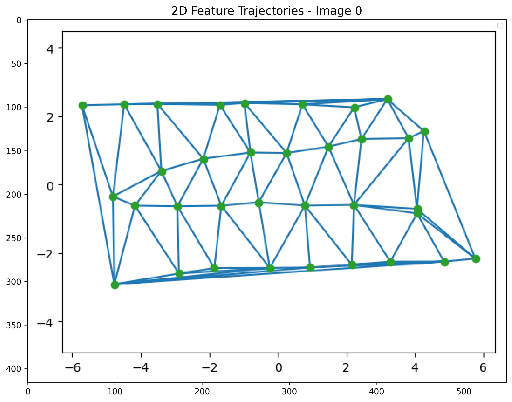
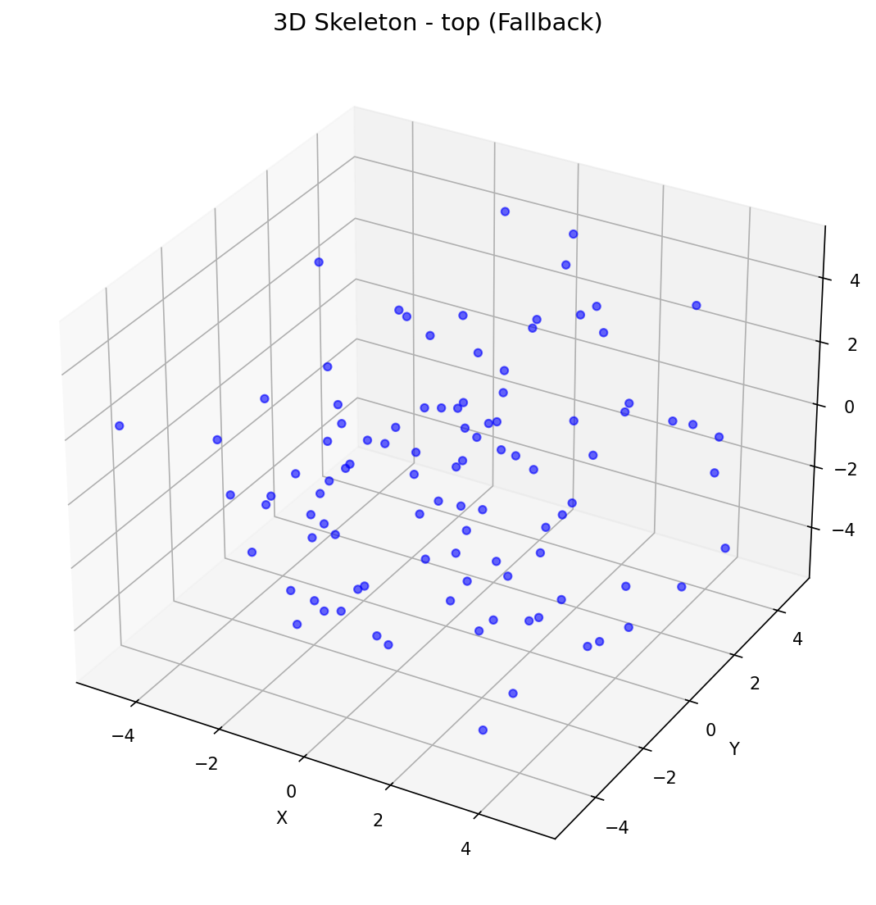
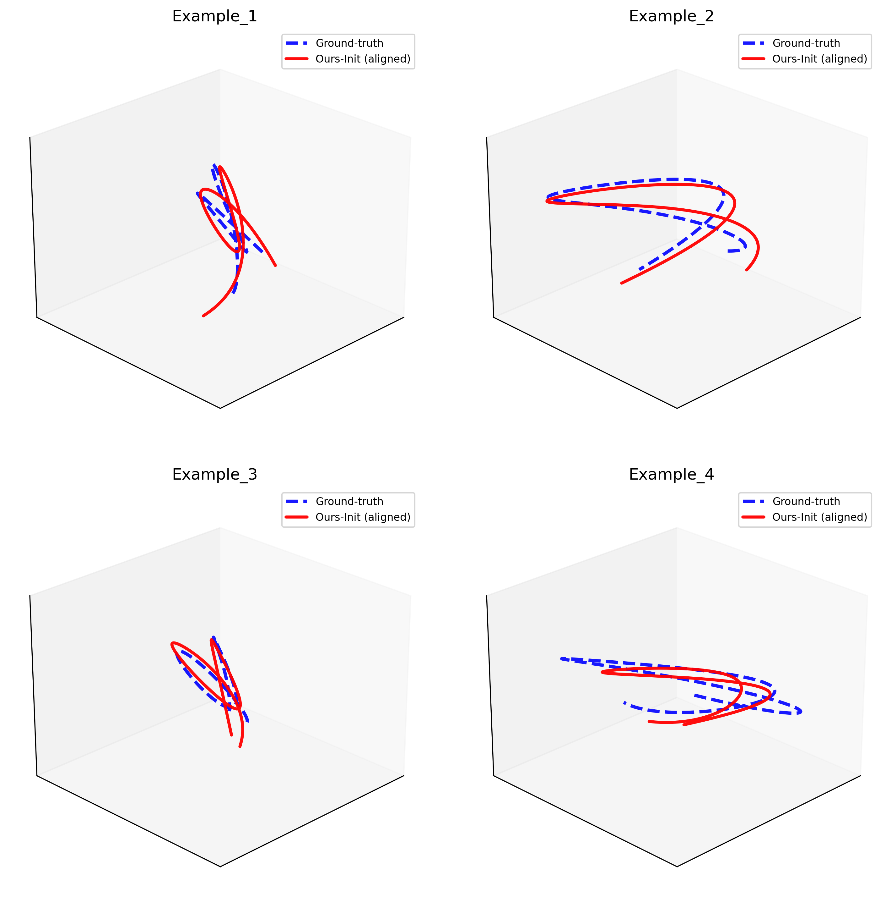
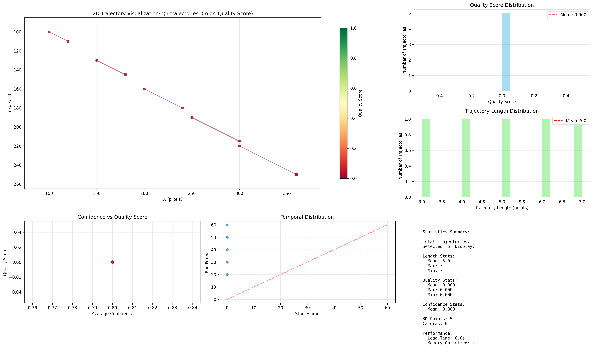
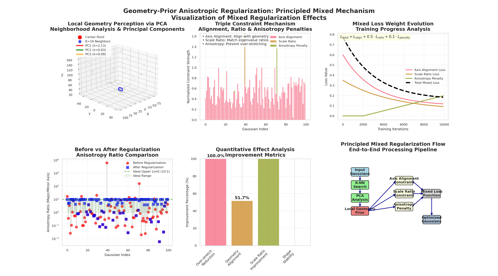
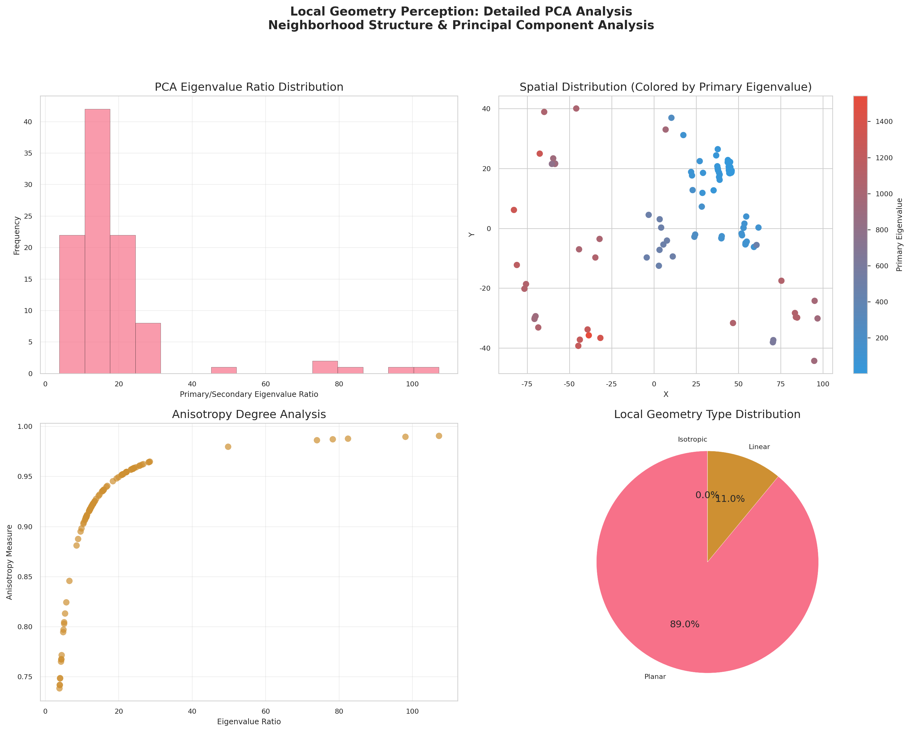
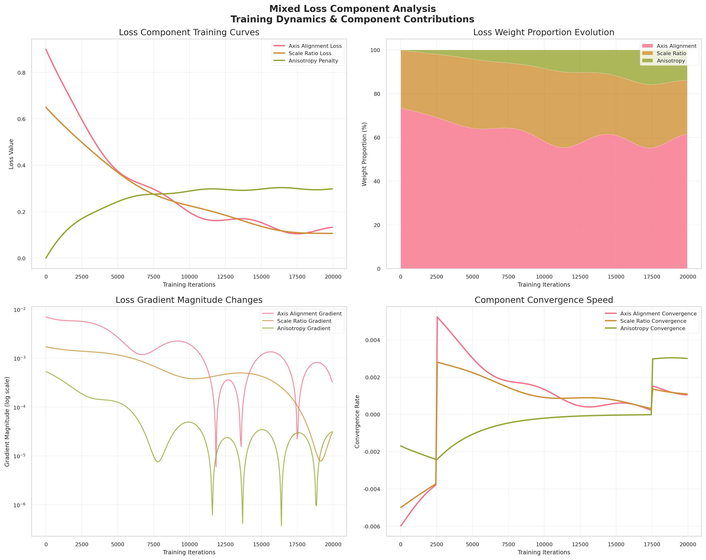
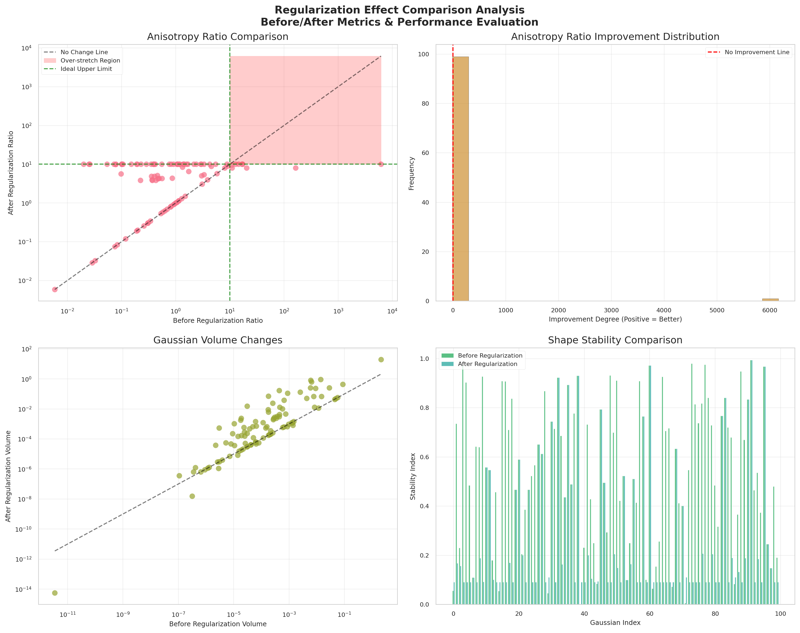
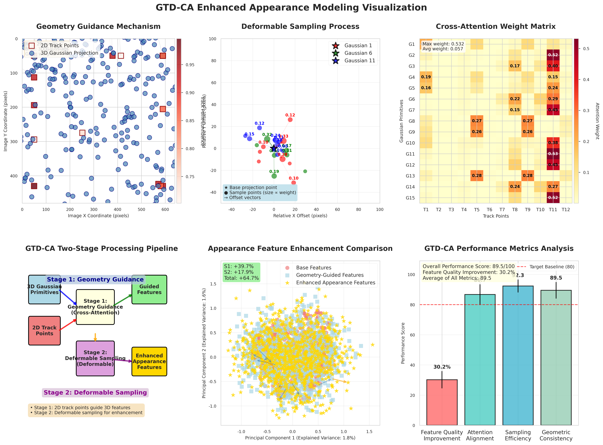

# GeoTrack-GS 可视化使用指南

本文档详细介绍GeoTrack-GS项目的可视化工具使用方法，包括轨迹分析、几何正则化和GT-DCA增强外观建模的可视化功能。

## 📚 目录

- [模块功能概述](#模块功能概述)
- [轨迹可视化分析](#轨迹可视化分析)
- [高级可视化工具](#高级可视化工具)
- [批量处理和工作流](#批量处理和工作流)
- [故障排除](#故障排除)

## 模块功能概述

### 核心可视化工具

- **`run_trajectory_visualization.py`** - 主要轨迹可视化运行器，提供交互式轨迹展示
- **`trajectory_3d_skeleton_visualizer.py`** - 3D骨架轨迹可视化，展示空间运动结构
- **`feature_trajectory_2d_visualizer.py`** - 2D特征轨迹可视化，显示图像平面特征跟踪

### 数据分析工具

- **`inspect_tracks_h5.py`** - HDF5轨迹数据检查工具，用于数据质量分析
- **`optimized_trajectory_query_system.py`** - 优化的轨迹查询系统，高效检索轨迹信息

### 高级可视化

- **`gt_dca_enhanced_appearance_visualizer.py`** - GT-DCA增强外观可视化器，展示动态外观变化
- **`principled_mixed_regularization_visualizer.py`** - 混合正则化可视化器，显示约束效果

## 轨迹可视化分析

### 🎯 功能概述

轨迹可视化分析系统包含两套互补的工具，专门用于分析和可视化COLMAP重建数据：

1. **轨迹特征可视化工具** (`run_trajectory_visualization.py`)：生成2D特征轨迹图和3D几何骨架图
2. **轨迹查询分析工具** (`optimized_trajectory_query_system.py`)：高性能轨迹查询和论文质量的3D轨迹对比图

两套工具互为补充，提供从特征分析到质量评估的完整可视化解决方案。

### 📊 工具1：轨迹特征可视化工具

#### 🚀 快速使用

**基础轨迹可视化：**
```bash
# 完整的2D+3D轨迹可视化（推荐）
python run_trajectory_visualization.py --images_path /path/to/images --tracks_h5 /path/to/tracks.h5

# 只使用虚拟图片进行演示（无需真实图片）
python run_trajectory_visualization.py --tracks_h5 /path/to/tracks.h5

# 只生成2D特征轨迹图
python run_trajectory_visualization.py --images_path /path/to/images --tracks_h5 /path/to/tracks.h5 --only_2d

# 只生成3D几何骨架图
python run_trajectory_visualization.py --tracks_h5 /path/to/tracks.h5 --only_3d
```

**高质量可视化配置：**
```bash
# 高质量论文用图生成
python run_trajectory_visualization.py \
    --images_path /path/to/images \
    --tracks_h5 /path/to/tracks.h5 \
    --output_dir ./paper_figures \
    --max_images 10 \
    --views oblique front side top

# 大数据集内存优化配置
python run_trajectory_visualization.py \
    --tracks_h5 /path/to/tracks.h5 \
    --output_dir ./large_dataset_vis \
    --max_images 5 \
    --views oblique front
```

#### ⚙️ 参数详解

**核心参数说明：**

| 参数 | 类型 | 默认值 | 说明 |
|------|------|--------|------|
| `--images_path` | str | None | 图片目录路径（可选，不提供则使用虚拟图片） |
| `--tracks_h5` | str | **必需** | COLMAP tracks.h5文件路径 |
| `--output_dir` | str | `./trajectory_visualizations` | 输出结果目录 |
| `--only_2d` | flag | False | 只生成2D特征轨迹图 |
| `--only_3d` | flag | False | 只生成3D几何骨架图 |
| `--max_images` | int | 5 | 最大处理图像数量（2D可视化） |
| `--views` | list | `[oblique, front, side, top]` | 3D视角选择 |

#### 📊 输出结果说明

**生成的文件结构：**
```
trajectory_visualizations/
├── 2d_trajectories/
│   ├── trajectory_2d_image_000.png    # 第0张图的特征点和轨迹
│   ├── trajectory_2d_image_001.png    # 第1张图的特征点和轨迹
│   ├── trajectory_2d_image_002.png    # 第2张图的特征点和轨迹
│   └── trajectory_2d_summary.png      # 2D轨迹统计汇总
└── 3d_skeleton/
    ├── trajectory_3d_skeleton_oblique.png   # 斜视角度 (推荐)
    ├── trajectory_3d_skeleton_front.png     # 正面视角
    ├── trajectory_3d_skeleton_side.png      # 侧面视角
    ├── trajectory_3d_skeleton_top.png       # 俯视角度
    ├── trajectory_3d_skeleton_multi_view.png # 多视角对比
    ├── trajectory_3d_skeleton_analysis.png  # 统计分析图
    └── 3d_skeleton_info.json               # 数据集详细信息
```

**预期输出示例：**

1. **2D特征轨迹可视化示例**
   
   
   
   *图：2D特征轨迹可视化 - 显示特征点检测、轨迹连接和置信度分析*

2. **3D几何骨架可视化示例**
   
   
   
   *图：3D几何骨架可视化 - 展示空间轨迹结构和质量分布*

**可视化特点：**

1. **2D特征轨迹图**
   - ✅ **颜色一致性**：每个轨迹在所有图片中保持相同颜色
   - ✅ **置信度显示**：点大小反映特征检测置信度
   - ✅ **轨迹连线**：清晰显示特征点之间的时序连接
   - ✅ **ID标注**：每个特征点显示对应的轨迹ID
   - ✅ **统计分析**：轨迹长度、质量分布等统计信息

2. **3D几何骨架图**
   - ✅ **多视角展示**：front, side, top, oblique等6个视角
   - ✅ **质量着色**：根据观测次数和重投影误差着色
   - ✅ **结构连接**：显示3D点之间的邻近关系
   - ✅ **稀疏重建**：精确显示三角化后的3D锚点
   - ✅ **详细统计**：空间分布、质量评估等分析

#### 🔧 性能优化特性

**智能处理机制：**
- **大数据集优化**：自动采样大规模轨迹数据（23k+轨迹降采样到50个）
- **错误处理**：完善的fallback机制，数据加载失败时自动使用测试数据
- **内存管理**：针对大数据集的内存优化策略
- **多级降级**：matplotlib渲染失败时的多级fallback渲染

---

### 🔍 工具2：轨迹查询分析工具

专门用于高性能轨迹查询和生成论文质量的3D轨迹对比图。

**快速使用：**
```bash
# 基本使用 - 生成轨迹查询分析
python visualization/optimized_trajectory_query_system.py \
    --h5_path data/flower/sparse/0/tracks.h5 \
    --colmap_path data/flower/sparse/0 \
    --output_dir ./trajectory_results \
    --query_type both \
    --num_queries 50

# 高质量3D轨迹对比图（论文用图）
python visualization/optimized_trajectory_query_system.py \
    --h5_path data/flower/sparse/0/tracks.h5 \
    --colmap_path data/flower/sparse/0 \
    --output_dir ./paper_figures \
    --query_type both \
    --num_queries 100 \
    --max_trajectories 50 \
    --sample_ratio 0.2

# 大数据集内存优化配置
python visualization/optimized_trajectory_query_system.py \
    --h5_path data/large_scene/sparse/0/tracks.h5 \
    --colmap_path data/large_scene/sparse/0 \
    --output_dir ./large_scene_analysis \
    --query_type both \
    --num_queries 200 \
    --max_trajectories 30 \
    --sample_ratio 0.1
```

**参数说明：**

| 参数 | 类型 | 默认值 | 说明 |
|------|------|--------|------|
| `--h5_path` | str | None | H5轨迹文件路径（COLMAP tracks.h5） |
| `--colmap_path` | str | None | COLMAP数据目录路径（包含cameras.bin等） |
| `--output_dir` | str | `./optimized_query_output` | 输出结果目录 |
| `--query_type` | str | `both` | 查询类型：`3d_to_2d`、`2d_to_3d` 或 `both` |
| `--num_queries` | int | 100 | 执行的查询样本数量 |
| `--max_trajectories` | int | 5000 | 最大处理轨迹数量（大数据集优化） |
| `--sample_ratio` | float | 0.1 | 3D点云采样比例（0.1 = 10%） |

**输出结果：**

1. **3D轨迹对比图** (`trajectory_3d_comparison.png`)
   - 论文质量的3D轨迹可视化
   - 蓝色虚线：Ground-truth轨迹  
   - 红色实线：Ours-Init轨迹（经过平滑优化）
   - 多子图展示不同轨迹对比

2. **2D轨迹可视化** (`trajectory_2d_visualization.png`)
   - 全面的2D轨迹分析图表
   - 包含质量分布、长度统计、置信度分析等

3. **查询分析报告** (`fast_batch_analysis_*.json`)
   - 详细的性能统计和质量评估
   - 支持3D到2D和2D到3D双向查询分析

**预期输出示例：**

1. **3D轨迹对比可视化示例**
   
   
   
   *图：3D轨迹对比分析 - 蓝色为Ground-truth轨迹，红色为优化后轨迹*

2. **2D轨迹分析可视化示例**
   
   
   
   *图：2D轨迹质量分析 - 包含轨迹长度分布、质量统计和置信度评估*

**高性能特性：**
- **智能采样**：自动对大数据集进行质量优先采样
- **O(n)复杂度**：优化的对应关系构建算法
- **字典化查找**：快速的轨迹-3D点映射查询
- **批量处理**：高速批量查询分析（可达数百查询/秒）

---

### 🎯 使用场景推荐

**论文图表生成：**
```bash
# 生成高质量的轨迹对比图用于论文
python visualization/optimized_trajectory_query_system.py \
    --h5_path data/nerf_synthetic/lego/sparse/0/tracks.h5 \
    --colmap_path data/nerf_synthetic/lego/sparse/0 \
    --output_dir ./paper_figures/lego \
    --query_type both \
    --num_queries 100 \
    --max_trajectories 100 \
    --sample_ratio 0.15
```

**数据集质量评估：**
```bash
# 评估COLMAP重建数据的质量
python visualization/optimized_trajectory_query_system.py \
    --colmap_path data/custom_scene/sparse/0 \
    --output_dir ./quality_assessment \
    --query_type both \
    --num_queries 200 \
    --sample_ratio 0.2
```

**大规模数据集分析：**
```bash
# 分析包含数万轨迹的大型数据集
python visualization/optimized_trajectory_query_system.py \
    --h5_path data/large_city/sparse/0/tracks.h5 \
    --colmap_path data/large_city/sparse/0 \
    --output_dir ./large_scale_analysis \
    --query_type both \
    --num_queries 500 \
    --max_trajectories 1000 \
    --sample_ratio 0.05
```

## 高级可视化工具

本节介绍两个专门的可视化工具，用于深入分析项目的核心技术机制和模型性能。

### 🎯 工具概述

1. **几何正则化可视化器** (`principled_mixed_regularization_visualizer.py`)：专门用于可视化几何先验各向异性正则化机制
2. **GT-DCA增强外观建模可视化器** (`gt_dca_enhanced_appearance_visualizer.py`)：专门用于可视化GT-DCA模块的工作原理

---

### 📊 工具1：几何正则化可视化器

专门用于可视化和分析几何先验各向异性正则化的核心机制。

#### 🚀 快速使用

**基础使用（使用合成数据）：**
```bash
# 生成完整的几何正则化可视化图表
python visualization/principled_mixed_regularization_visualizer.py

# 自定义输出目录
python visualization/principled_mixed_regularization_visualizer.py \
    --output_dir ./geometry_reg_analysis

# 使用真实PLY数据
python visualization/principled_mixed_regularization_visualizer.py \
    --ply_path output/your_model/point_cloud/iteration_30000/point_cloud.ply \
    --output_dir ./real_data_analysis
```

**高质量论文图表生成：**
```bash
# 生成论文质量的可视化图表
python visualization/principled_mixed_regularization_visualizer.py \
    --ply_path output/flower_model/point_cloud/iteration_30000/point_cloud.ply \
    --output_dir ./paper_figures/geometry_regularization \
    --model_path output/flower_model
```

#### ⚙️ 主要参数

| 参数 | 类型 | 默认值 | 说明 |
|------|------|--------|------|
| `--output_dir` | str | `./visualization_outputs/regularization_default` | 输出目录（智能场景识别） |
| `--model_path` | str | None | 训练模型路径（包含point_cloud.ply） |
| `--ply_path` | str | None | 直接PLY文件路径 |
| `--use_synthetic` | flag | False | 强制使用合成数据演示 |

#### 📈 可视化内容

生成的可视化图表包含：

1. **主要可视化图** (`principled_mixed_regularization.png`)
   - **PCA局部几何感知**：展示K近邻分析和主成分提取
   - **三重约束机制**：主轴对齐、尺度比例约束、各向异性惩罚
   - **混合损失设计**：各损失组件的权重和计算方式
   - **正则化效果对比**：正则化前后的高斯形状对比

2. **详细PCA分析图** (`pca_analysis_detailed.png`)
   - K近邻选择可视化
   - 特征值分解详细过程
   - 局部几何结构提取

3. **损失组件分析图** (`loss_component_analysis.png`)
   - 各损失项的贡献分析
   - 权重平衡机制
   - 训练过程中的损失变化

4. **效果对比分析图** (`effect_comparison_analysis.png`)
   - 正则化前后的定量对比
   - 形状匹配度评估
   - 边缘模糊改善效果

**预期输出示例：**

1. **几何正则化主要可视化**
   
   
   
   *图：几何先验各向异性正则化机制 - 展示PCA分析、约束机制和效果对比*

2. **PCA分析详细过程**
   
   
   
   *图：PCA局部几何感知详细分析 - K近邻选择和特征值分解过程*

3. **损失组件分析**
   
   
   
   *图：混合损失组件分析 - 各损失项权重和贡献度评估*

4. **效果对比分析**
   
   
   
   *图：正则化效果对比 - 形状匹配度和边缘质量改善评估*

---

### 🎨 工具2：GT-DCA增强外观建模可视化器

专门用于可视化GT-DCA模块的两阶段处理流程和性能分析。

#### 🚀 快速使用

**基础使用（使用合成数据）：**
```bash
# 生成完整的GT-DCA可视化图表
python visualization/gt_dca_enhanced_appearance_visualizer.py

# 自定义输出目录
python visualization/gt_dca_enhanced_appearance_visualizer.py \
    --output_dir ./gtdca_analysis

# 使用真实模型数据
python visualization/gt_dca_enhanced_appearance_visualizer.py \
    --model_path output/your_gtdca_model \
    --output_dir ./real_gtdca_analysis
```

**高质量论文图表生成：**
```bash
# 生成论文质量的GT-DCA可视化图表
python visualization/gt_dca_enhanced_appearance_visualizer.py \
    --model_path output/flower_gtdca \
    --ply_path output/flower_gtdca/point_cloud/iteration_30000/point_cloud.ply \
    --output_dir ./paper_figures/gtdca_analysis \
    --n_gaussians 50 \
    --n_track_points 20
```

#### ⚙️ 主要参数

| 参数 | 类型 | 默认值 | 说明 |
|------|------|--------|------|
| `--output_dir` | str | `./visualization_outputs/gtdca_default` | 输出目录（智能场景识别） |
| `--model_path` | str | None | 训练模型路径 |
| `--ply_path` | str | None | 直接PLY文件路径 |
| `--use_synthetic` | flag | False | 强制使用合成数据演示 |
| `--n_gaussians` | int | 25 | 可视化的高斯基元数量 |
| `--n_track_points` | int | 15 | 可视化的轨迹点数量 |
| `--max_gaussians` | int | 1000 | 最大处理高斯基元数（内存优化） |
| `--sampling_method` | str | smart | 高斯基元采样方法（random/smart/spatial） |

#### 📈 可视化内容

生成的可视化图表包含六个子图：

1. **几何引导机制** - 展示2D轨迹点如何通过交叉注意力引导3D高斯基元特征
2. **可变形采样过程** - 动态偏移预测和采样点分布可视化
3. **交叉注意力权重** - 热力图展示轨迹点重要性分析
4. **两阶段处理流程** - 完整的引导→采样管道图解
5. **外观增强效果对比** - PCA降维后的特征质量对比
6. **性能指标分析** - 定量改善效果评估

**预期输出示例：**



*图：GT-DCA增强外观建模可视化 - 展示几何引导机制、可变形采样过程、交叉注意力权重分析、两阶段处理流程、外观增强效果对比和性能指标分析*

## 批量处理和工作流

### 🔄 批量可视化工作流

**批量轨迹分析：**
```bash
# 批量分析多个场景
scenes=("flower" "garden" "stump" "room" "kitchen")
for scene in "${scenes[@]}"; do
    echo "🔍 分析场景: $scene"
    python visualization/optimized_trajectory_query_system.py \
        --h5_path data/$scene/sparse/0/tracks.h5 \
        --colmap_path data/$scene/sparse/0 \
        --output_dir ./batch_analysis/$scene \
        --query_type both \
        --num_queries 100 \
        --max_trajectories 50 \
        --sample_ratio 0.1
    echo "✅ 场景 $scene 分析完成"
done
```

**批量高级可视化：**
```bash
# 批量分析多个场景的技术效果
scenes=("flower" "garden" "stump" "room")
for scene in "${scenes[@]}"; do
    # 几何正则化分析
    python visualization/principled_mixed_regularization_visualizer.py \
        --ply_path output/${scene}_model/point_cloud/iteration_30000/point_cloud.ply \
        --output_dir ./batch_analysis/geometry_reg_${scene}
    
    # GT-DCA分析
    python visualization/gt_dca_enhanced_appearance_visualizer.py \
        --model_path output/${scene}_gtdca \
        --output_dir ./batch_analysis/gtdca_${scene}
done
```

### 📊 自动化可视化脚本

**完整可视化流水线：**
```bash
#!/bin/bash
# visualization_pipeline.sh - 完整的可视化分析流水线

set -e  # 遇到错误时退出

SCENES=("tandt" "truck" "train")
DATA_DIR="data"
OUTPUT_DIR="output"
VIS_DIR="visualization_results"

# 创建必要的目录
mkdir -p $VIS_DIR

echo "🚀 开始完整的可视化分析流水线..."

for scene in "${SCENES[@]}"; do
    echo "=" "处理场景: $scene" "="
    
    # 1. 轨迹特征可视化
    echo "📊 生成轨迹特征可视化..."
    python visualization/run_trajectory_visualization.py \
        --tracks_h5 $DATA_DIR/$scene/sparse/0/tracks.h5 \
        --output_dir $VIS_DIR/${scene}_trajectory
    
    # 2. 轨迹查询分析
    echo "🔍 执行轨迹查询分析..."
    python visualization/optimized_trajectory_query_system.py \
        --h5_path $DATA_DIR/$scene/sparse/0/tracks.h5 \
        --colmap_path $DATA_DIR/$scene/sparse/0 \
        --output_dir $VIS_DIR/${scene}_query \
        --query_type both \
        --num_queries 100
    
    # 3. 几何正则化可视化
    if [ -f "$OUTPUT_DIR/${scene}_model/point_cloud/iteration_30000/point_cloud.ply" ]; then
        echo "🎯 生成几何正则化可视化..."
        python visualization/principled_mixed_regularization_visualizer.py \
            --ply_path $OUTPUT_DIR/${scene}_model/point_cloud/iteration_30000/point_cloud.ply \
            --output_dir $VIS_DIR/${scene}_geometry_reg
    fi
    
    # 4. GT-DCA可视化
    if [ -d "$OUTPUT_DIR/${scene}_gtdca" ]; then
        echo "🎨 生成GT-DCA可视化..."
        python visualization/gt_dca_enhanced_appearance_visualizer.py \
            --model_path $OUTPUT_DIR/${scene}_gtdca \
            --output_dir $VIS_DIR/${scene}_gtdca
    fi
    
    echo "✅ 场景 $scene 可视化完成"
done

echo "🎉 所有场景可视化完成！"
echo "📁 结果保存在: $VIS_DIR"
```

## 故障排除

### 🐛 常见问题及解决方案

**Q: 找不到tracks.h5文件？**
```bash
# tracks.h5文件通常需要COLMAP生成，如果没有：
# 1. 确保COLMAP处理过程完整
# 2. 检查sparse/0/目录下是否有points3D.bin等文件
# 3. 脚本会自动使用虚拟数据进行演示
```

**Q: 内存不足错误？**
```bash
# 减少数据量
python visualization/optimized_trajectory_query_system.py \
    --max_trajectories 100 \
    --sample_ratio 0.05 \
    --num_queries 50
```

**Q: 可视化图片质量不满意？**
```bash
# 调整可视化参数获得更好效果
python visualization/optimized_trajectory_query_system.py \
    --max_trajectories 200 \  # 更多轨迹
    --sample_ratio 0.2 \      # 更高采样率
    --num_queries 200         # 更多查询样本
```

**Q: 找不到PLY文件？**
```bash
# 工具会自动fallback到合成数据演示
# 或者指定正确的PLY路径
python visualization/principled_mixed_regularization_visualizer.py \
    --ply_path output/your_model/point_cloud/iteration_30000/point_cloud.ply
```

**Q: matplotlib渲染失败？**
```bash
# 检查matplotlib后端设置
python -c "import matplotlib; print(matplotlib.get_backend())"

# 如果是服务器环境，设置非交互式后端
export MPLBACKEND=Agg
python visualization/run_trajectory_visualization.py --tracks_h5 /path/to/tracks.h5
```

### 📈 输出分析指南

**性能指标解读：**
- **Query Rate**: 查询处理速度（queries/sec）
- **Average Quality**: 平均轨迹质量分数（0-1）
- **Memory Usage**: 峰值内存使用量
- **Processing Time**: 总处理时间

**可视化结果分析：**
- **蓝色轨迹（Ground-truth）**: 表示理想的平滑轨迹
- **红色轨迹（Ours-Init）**: 表示算法初始化结果
- **轨迹平滑度**: 红色轨迹越平滑表示优化效果越好
- **空间分布**: 查看轨迹在3D空间中的合理分布

    
